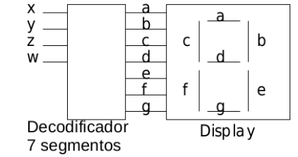
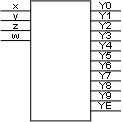
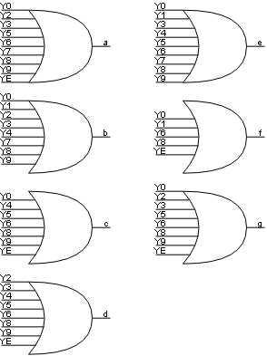

# Bloques constructivos: Decodificador

**Fecha:** 17-09-2026

## Consigna

Se desea implementar un display de siete segmentos. Para entradas en el rango $0\ldots9$ se debe desplegar el dígito correspondiente. En otro caso se debe desplegar la letra E.

La salida son $7$ valores que corresponden a cada uno de los segmentos. Un segmento se enciende cuando se pone un $1$ en la entrada correspondiente.

1. Construir el decodificador 7 segmentos utilizando un decodificador y compuertas OR.
2. Construir el decodificador hallando la expresión mínima en dos niveles para cada una de sus salidas.

## Resolución

### Parte 1

- Construir el decodificador 7 segmentos utilizando un decodificador y compuertas OR.

Esto no tiene demasiada dificultad, se trata principalmente de diseñar el circuito.
Lo que si ayuda para las compuertas OR, es identificar para qué números se enciende cada segmento del display.

$$
\begin{array}{c||c|c|c|c|c|c|c}
\#&a&b&c&d&e&f&g\\
\hline
0&1&1&1&&1&1&1\\
1&&1&&&1&&\\
2&1&1&&1&&1&1\\
3&1&1&&1&1&&1\\
4&&1&1&1&1&&\\
5&1&&1&1&1&&1\\
6&1&&1&1&1&1&1\\
7&1&1&&&1\\
8&1&1&1&1&1&1&1\\
9&1&1&1&1&1&&1\\
E&1&&1&1&&1&1\\
\end{array}
$$

Nota: Como todos los números posteriores al $10$ tienen la misma representación, los juntamos bajo la notación $E$.

Como el diagrama tiene muchas conexiones,se haría díficil de juntar todo en uno, por lo tanto se mostrarán en dos imágenes diferentes; en una veremos el decodificador que utilizaremos, mientras que en la otra veremos todas las compuertas OR correspondientes a los siete segmentos del display.

**Nota:** YE representa las últimas seis salidas, es decir: Y10, Y11, Y12, Y13, Y14, Y15. Se diagrama así para ahorrar espacio.

Esto concluye la parte 1.