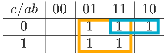
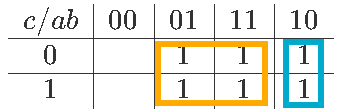
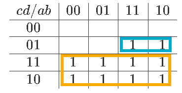

# Mapa de Karnaugh

**Fecha:** 14-09-2026

## Consigna

Simplificar las siguientes expresiones booleanas usando mapas de Karnaugh.

1. $a\overline{b}(a+\overline{b})\overline{c}+b$
2. $a+b+\overline{(\overline{a}+b+c)}$
3. $bc+da+c+dc(ab+dc)$

## Resolución

### Expresión #1

- $a\overline{b}(a+\overline{b})\overline{c}+b$

Primero hacemos la tabla, simplemente verificando si la expresión es verdadera o no para los valores de las variables que indican las celdas

$$
\begin{array}{c|c|c|c|c}
c/ab&00&01&11&10\\
\hline
0&&1&1&1\\
\hline
1&&1&1\\
\end{array}
$$

Luego hacemos los rectángulos:

Entonces la expresión más reducida para la expresión inicial es:

- $b+a\overline{c}$

### Expresión #2

- $a+b+\overline{(\overline{a}+b+c)}$

Primero hacemos la tabla, simplemente verificando si la expresión es verdadera o no para los valores de las variables que indican las celdas

$$
\begin{array}{c|c|c|c|c}
c/ab&00&01&11&10\\
\hline
0&&1&1&1\\
\hline
1&&1&1&1\\
\end{array}
$$

Luego hacemos los rectángulos:

Entonces la expresión más reducida para la expresión inicial es:

- $b+a\overline{b}$

### Expresión #3

- $bc+da+c+dc(ab+dc)$

Primero hacemos la tabla, simplemente verificando si la expresión es verdadera o no para los valores de las variables que indican las celdas

$$
\begin{array}{c|c|c|c|c}
cd/ab&00&01&11&10\\
\hline
00\\
\hline
01&&&1&1\\
\hline
11&1&1&1&1\\
\hline
10&1&1&1&1\\
\end{array}
$$

Luego hacemos los rectángulos:

Entonces la expresión más reducida para la expresión inicial es:

- $c+a\overline{c}d$

---

Esto concluye el ejercicio.