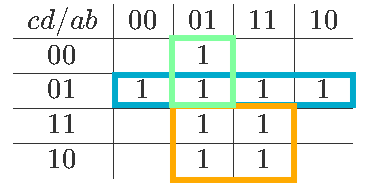

# Álgebra de Boole aplicada

**Fecha:** 14-09-2026

## Consigna

A un corredor de seguros se le dan las siguientes instrucciones: se debe extender una póliza 22 toda vez que el solicitante sea una mujer casada de más de 25 años, un hombre casado de menos de 25 años que nunca ha solicitado una póliza 19, una mujer menor de 25 años, un hombre casado poseedor de una póliza 19, o un hombre casado de más de 25 años que no tiene póliza 19.
Utilizando las siguientes variables booleanas:
- $a$ para indicar la posesión de la póliza 19
- $b$ para indicar que el solicitante es casado
- $c$ para indicar que el solicitante es hombre
- $d$ para indicar que el solicitante es menor de 25 años

Se pide:
- Construir la tabla de especificación para los casos en que debe extenderse una póliza 22. Reducir la expresión que se obtenga.
- Escribir las instrucciones al corredor de seguros de la forma más sencilla posible.

## Resolución

Separamos la resolución en dos partes fundamentales. En primer lugar hallaremos una expresión booleana que represente lo que queremos decir en lenguaje natural mediante una expresión booleana.
Luego simplificaremos esta expresión en la última parte.

### Expresión booleana

El primer paso para la resolución es "traducir" las condiciones en lenguaje natural a una expresión booleana.

> el solicitante sea una mujer casada de más de 25 años

- $b\overline{cd}$

> un hombre casado de menos de 25 años que nunca ha solicitado una póliza 19

- $\overline{a}bcd$

> una mujer menor de 25 años

- $\overline{c}d$

> un hombre casado poseedor de una póliza 19

- $abc$

> un hombre casado de más de 25 años que no tiene póliza 19

- $\overline{a}bc\overline{d}$

Ahora que tenemos las condiciones bajo las cuales se debe extender una póliza 22, solo debemos unir las condiciones que hallamos con $+$, que representan los ó lógicos.
Con esto obtenemos que la expresión final es:

$$
f(a,b,c,d)=b\overline{cd}+\overline{a}bcd+\overline{c}d+abc+\overline{a}bc\overline{d}
$$

### Simplificación

Utilizando el mapa de Karnaugh, simplificamos la expresión.

De donde sacamos la expresión más reducida posible:

- $f(a,b,c,d)=\overline{c}d+\overline{a}b\overline{c}+bc$

Ahora, para darle las instrucciones más simples al corredor de seguros, recordemos las reglas:

- $a$ para indicar la posesión de la póliza 19
- $b$ para indicar que el solicitante es casado
- $c$ para indicar que el solicitante es hombre
- $d$ para indicar que el solicitante es menor de 25 años

Entonces, se extenderá una póliza 22 siempre y cuando:

> el solicitante sea una mujer menor de 25 años; el solicitante sea una mujer casada que no posee la póliza 19; o el solicitante sea un hombre casado.

Esto concluye el ejercicio.