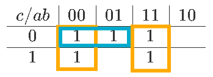
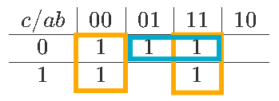

# Mapa de Karnaugh

**Fecha:** 16-09-2026

## Consigna

Mostrar con un ejemplo que el mínimo en dos niveles no es único.
Sugerencia: Usar mapas de Karnaugh

## Resolución

> el mínimo en dos niveles no es único

"En dos niveles" hace referencia a la cantidad de niveles de compuertas.
Básicamente queremos probar que hay más de una simplificación mínima válida para una función booleana dada.

Consideremos una función booleana representada por el siguiente mapa de Karnaugh:

$$
\begin{array}{c|c|c|c|c}
c/ab&00&01&11&10\\
\hline
0&1&1&1\\
\hline
1&1&&1\\
\end{array}
$$

Al agrupar por rectángulos, observemos que existe más de una solución válida:

Cada una deriva en una expresión mínima, ellas son respectivamente:

- $f(a,b,c)=\overline{ac}+\overline{ab}+ab$
- $f(a,b,c)=a\overline{c}+\overline{ab}+ab$

Esto demuestra que el mínimo en dos niveles no es único, por lo que se concluye el ejercicio.