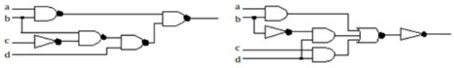

# Circuitos combinatorios y leyes de De Morgan

**Fecha:** 16-09-2026

## Consigna

Probar que los dos circuitos en la figura siguiente implementan la misma función lógica:

## Resolución

Primero, empezamos determinando las expresiones que representan los circuitos:

- $c_1=\overline{\left(\overline{(ab)}\cdot\overline{\left(\overline{(b\overline{c})}\cdot d\right)}\right)}$
- $c_2=\overline{\overline{\left(ab+\overline{b}d+cd\right)}}=ab+\overline{b}d+cd$

Antes de seguir, notemos que la expresión $c_1$ se puede simplificar usando leyes de De Morgan, por lo tanto:

$$
\begin{aligned}
&c_1\\
&=\scriptstyle{(\text{análisis del circuito})}\\
&\overline{\left(\overline{(ab)}\cdot\overline{\left(\overline{(b\overline{c})}\cdot d\right)}\right)}\\
&=\scriptstyle{(\text{De Morgan: }\overline{ab}=\overline{a}+\overline{b})}\\
&\overline{\left((\overline{a}+\overline{b})\cdot\overline{\left((\overline{b}+c)\cdot d\right)}\right)}\\
&=\scriptstyle{(\text{De Morgan: }\overline{ab}=\overline{a}+\overline{b})}\\
&\overline{\left((\overline{a}+\overline{b})\cdot(\overline{(\overline{b}+c)}+\overline{d})\right)}\\
&=\scriptstyle{(\text{De Morgan: }\overline{a+b}=\overline{a}\overline{b})}\\
&\overline{\left((\overline{a}+\overline{b})\cdot(b\overline{c}+\overline{d})\right)}\\
&=\scriptstyle{(\text{De Morgan: }\overline{ab}=\overline{a}+\overline{b})}\\
&\overline{(\overline{a}+\overline{b})}+\overline{(b\overline{c}+\overline{d})}\\
&=\scriptstyle{(\text{De Morgan: }\overline{a+b}=\overline{a}\overline{b})}\\
&ab+\overline{(b\overline{c})}\cdot d\\
&=\scriptstyle{(\text{De Morgan: }\overline{ab}=\overline{a}+\overline{b})}\\
&ab+(\overline{b}+c)\cdot d\\
&=\scriptstyle{(\text{distributividad})}\\
&ab+\overline{b}d+cd
\end{aligned}
$$

Por lo que $c_1=ab+\overline{b}d+cd$; que es exactamente la expresión de $c_2$.
Con esto podemos concluir que representan exactamente la misma función, pues tienen expresiones equivalentes.
