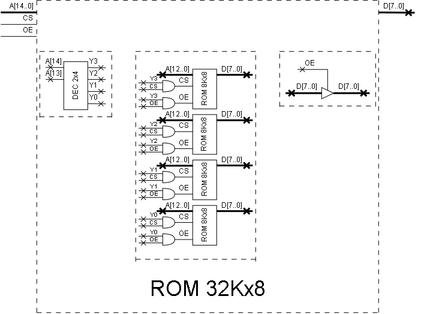
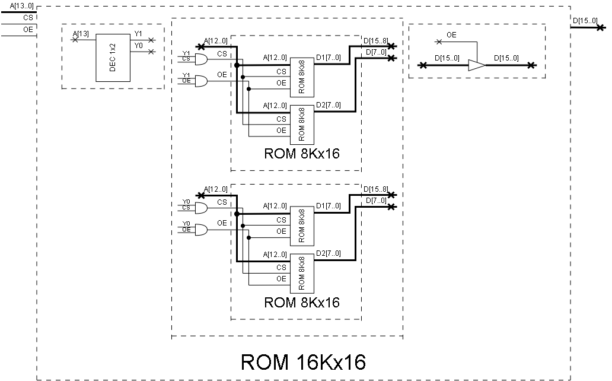

# Arreglos de memoria

**Fecha:** 21-09-2026

## Consigna

Se dispone de memorias ROM de 8Kx8.
1. Fabricar una memoria ROM de 32Kx8.
2. Fabricar una memoria ROM de 16Kx16.

## Resolución

### Parte 1

- Fabricar una memoria ROM de 32Kx8.

A continuación se muestra el diagrama de la memoria fabricada. Se utiliza un decodificador 2x4, que sirve para "elegir" cuales de las memorias ROM 8Kx8 se eligen.
Para finalizar se cuenta con estructuras tri-state para que la memoria ROM cuente con la funcionalidad OE.

### Parte 2

A continuación se muestra el diagrama de la memoria fabricada.
En este caso, antes del diagrama final, también se construyen memorias 8Kx16 para conseguir los 16 bits de salida.
Se utiliza un decodificador 1x2 por una cuestión de órden, que también sirve para elegir que memoria ROM 8Kx16 se utiliza.
Para finalizar se cuenta con estructuras tri-state para que la memoria ROM cuente con la funcionalidad OE.

---

Esto finaliza el ejercicio.