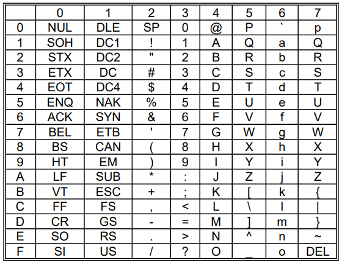

# Memoria ROM para implementar una función

**Fecha:** 23-09-2026

## Consigna

Se desea transformar caracteres ASCII mediante una ROM, de forma tal que:

- Convierta letras mayúsculas en minúsculas
- Convierta letras minúsculas en mayúsculas
- Los demás caracteres permanezcan sin cambios

1. Determinar el tamaño y organización de la ROM, y especificar el significado de sus entradas y salidas.
2. Escribir un programa que genere el contenido de la ROM.

## Resolución

### Parte 1

- Determinar el tamaño y organización de la ROM, y especificar el significado de sus entradas y salidas

Para esta parte, recordemos una tabla de los caracteres ASCII que nos dará gran parte de la respuesta.



Notemos que cada caracter tiene asociado un número hexadecimal que indica su código, desde el $\text{0x}0$ hasta $\text{0x7F}$.
Por esto mismo, necesitamos almacenar (por lo menos) desde el cero binario, hasta el $01111111\text{b}$, que es el binario de $\text{0x7F}$; haciendo otra transformación, determinamos la organización de la ROM:

- La organización de la ROM será de $128$

Por otra parte, el tamaño de la ROM también será del mismo tamaño (valga la redundancia), ya que necesitamos devolver otro código de un caracter ASCII. La única diferencia es que el tamaño se suele especificar en el número de bits, por lo tanto:

- El tamaño de la ROM será de $7$ bits.

Con esto podemos concluir la parte 1 diciendo que la ROM a construir será de la siguiente clase 128x7.

### Parte 2

- Escribir un programa que genere el contenido de la ROM.

Antes de empezar, marquemos algunos de los números importantes que servirán para el código:

$$
\begin{array}{c|c}
\text{A}&\text{0x41}\\
\text{Z}&\text{0x5A}\\
\text{a}&\text{0x61}\\
\text{z}&\text{0x7A}\\
\end{array}
$$

Además, un valor extra que es de utilidad es la "distancia" en la tabla ASCII entre una letra mayúscula y una minúscula. Esta se calcula por:

- $\text{0x61}-\text{0x41}$

```c
void cargar_rom(char* rom) {
    int distancia_mayus_minus = 0x61-0x41;
    for (int i=0; i < 128; i++) {
        // si estamos entre los caracteres en mayúscula
        if (i >= 0x41 && i <= 0x5A) {
            rom[i] = i + distancia_mayus_minus;
        // si estamos entre los caracteres en minúscula
        } else if (i >= 0x61 && i <= 0x7A) {
            rom[i] = i - distancia_mayus_minus;
        } else {
            rom[i] = i;
        }
    }
}
```

Esto concluye el ejercicio.
