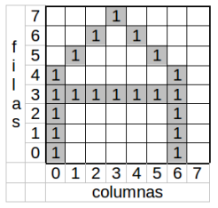
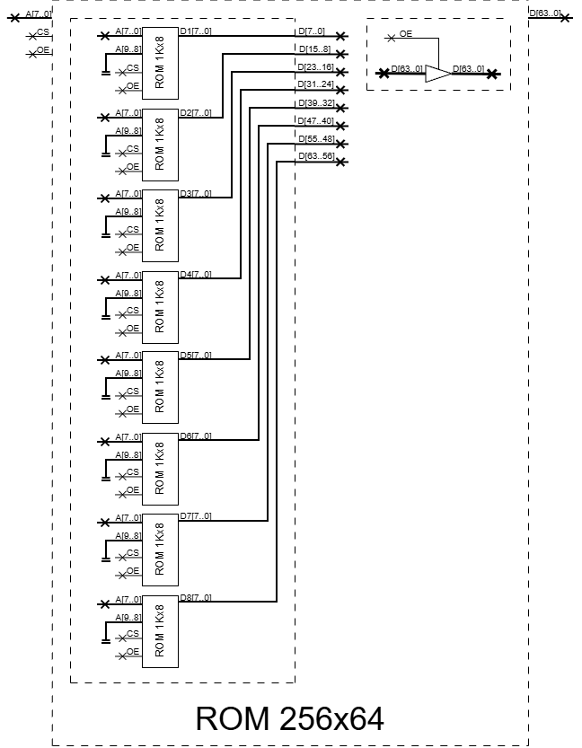

# Memoria ROM para implementar una función

**Fecha:** 23-09-2026

## Consigna

En las impresoras de matriz de puntos, los caracteres se representan como matrices de 8×8 puntos (del modo que se ejemplifica para el caracter A en la Figura 1). La impresora imprime una columna de puntos por vez. La descripción de cada carácter a ser impreso, representado en código ASCII extendido de 8 bits, se almacena en una ROM.

1. Definir las entradas, las salidas, el tamaño y la organización de la ROM necesaria.
2. ¿Cómo construiría la ROM necesaria basándose en memorias ROM de 1K×8?

## Resolución

### Parte 1

- Definir las entradas, las salidas, el tamaño y la organización de la ROM necesaria.

Responderemos a las preguntas punto a punto para que sea lo más claro posible.

1. **Entradas:** Cada dirección de la ROM almacenará el código correspondiente a cada caracter del código ASCII extendido de 8 bits.
2. **Salidas:** Se mapeará la matriz de 8x8 puntos como un solo arreglo. Cada bit corresponde a una posición en el arreglo (por lo tanto en la matriz) y su valor corresponderá a si corresponde dibujar el punto o no.
3. **Tamaño:** Por lo visto en la sección de entradas, el tamaño tendrá que ser correspondiente a 8 bits; por lo tanto a 256 direcciones.
4. **Organización:** Ya que queremos que cada bit corresponda a una posición en el arreglo (por lo tanto en la matriz), necesitamos 64 bits.

Podemos concluir esta parte entonces, definiendo que la ROM necesaria es de la clase 256x64.

### Parte 2

- ¿Cómo construiría la ROM necesaria basándose en memorias ROM de 1K×8?

Considerando lo que vimos en la parte uno, la ROM necesaria tiene un tamaño y organización de 256x64.
El primer punto que tenemos que considerar, es que necesitamos 64 bits de salida. Como las ROM que tenemos a disposición tienen 8 bits de salida, necesitaremos como mínimo 8 de ellas.

**Importante:** El segundo punto, es que estamos "sobrados" en cuanto a las direcciones de memoria. Por lo tanto esto no influye en la cantidad de memorias ROM auxiliares que necesitamos.

Otra observación para hacer, es que por estar "sobrados" en cuando a las direcciones de memoria, los últimos dos bits de las ROM auxiliares no serán utilizados.

Con todo esto en mente, dejamos el diagrama a continuación.

