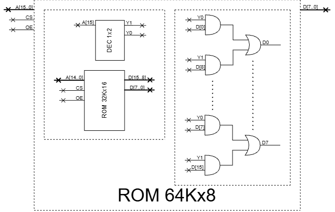
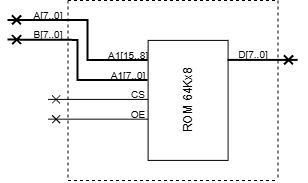

# Arreglos de memoria e implemntar funciones con memorias ROM

**Fecha:** 23-09-2026

## Consigna

Se dispone únicamente de una ROM 32Kx16.

1. Construir una ROM de 64K×8 bits utilizando el chip del que se dispone y compuertas lógicas.
2. Se utilizará la ROM para implementar un sumador simple (sin acarreo) de 8 bits. Especificar entradas y salidas necesarias, y dibujar el circuito sumador utilizando la ROM creada en la parte anterior.
3. Indicar el contenido de la ROM para la dirección 0x1794 para que el sumador devuelva la salida correcta (en esa entrada).

## Resolución

### Parte 1

- Construir una ROM de 64K×8 bits utilizando el chip del que se dispone y compuertas lógicas.

Se mostrará el diagrama y a continuación algunas observaciones.

1. El decodificador se utiliza para tener una mejor organización visual del circuito, no es necesario y puede ser reemplazado por una compuerta NOT.
2. Como necesitamos devolver 8 bits, el razonamiento es que cada dirección de memoria del chip 32Kx16, almacenaría 2 de los resultados que queremos devolver.
   Esta es la idea que se utiliza para el diseño de las compuertas.
3. Los puntos suspensivos indican repetir desde D0 hasta D7 de forma análoga.

### Parte 2

- Se utilizará la ROM para implementar un sumador simple (sin acarreo) de 8 bits. Especificar entradas y salidas necesarias, y dibujar el circuito sumador utilizando la ROM creada en la parte anterior.

Responderemos punto a punto para que sea más claro.

- **Entradas:** Dos números A y B de ocho bits. Estos son los números que queremos sumar.
- **Salidas:** Un número D resultante de sumar las entradas A y B.

La memoria ROM que diseñamos en la parte anterior es perfecta para esta función. Tiene el tamaño adecuado para la entrada (tenemos dos entradas de 8 bits, 8x2=16); también tiene el tamaño adecuado para la salida: 8 bits.
Tendríamos que programar la ROM para que cada dirección de memoria, como $\text{0xFFFF}$, tenga como su salida el resultado de la suma simple de los binarios $\text{0xFF}+\text{0xFF}$.

A continuación se muestra el diagrama que es muy trivial de entender a partir de lo que mencionamos.

### Parte 3

- Indicar el contenido de la ROM para la dirección 0x1794 para que el sumador devuelva la salida correcta (en esa entrada).

Como mencionamos en la parte anterior, la salida para esa dirección es el resultado de sumar los binarios de $\text{0x17}+\text{0x94}$.

$$
00010111\oplus10010100=10000011
$$

Entonces la respuesta para esta parte es 10000011.

---

Esto concluye el ejercicio.
