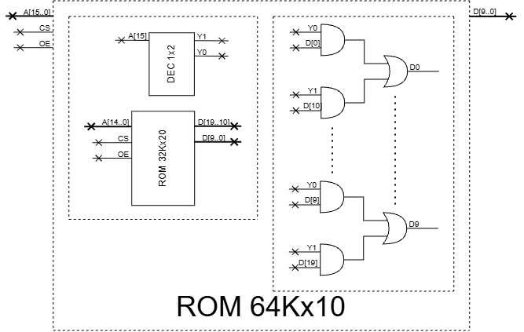
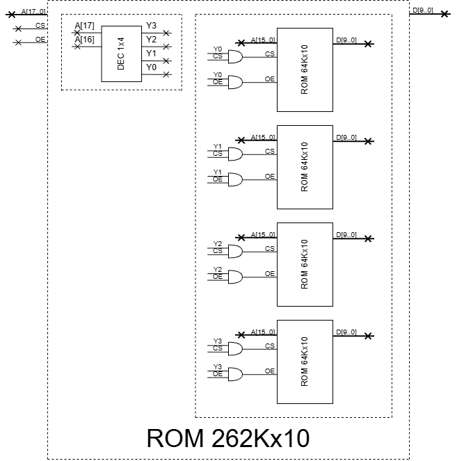

# Arreglos de memoria, programar una ROM

**Fecha:** 23-09-2026

## Consigna

1. Construya una memoria ROM de $2^{18}\times10$ a partir de la cantidad mínima de chips de memorias de $2^{15}\times20$ que sea posible.

2. Programe el contenido de la ROM de $2^{18}\times10$ construida en la parte 1 para simular el comportamiento de una ALU (circuito combinatorio en el que se pueden seleccionar diferentes operaciones a realizar) con una entrada compuesta por dos bits de operación y dos operandos de 8 bits, y una salida compuesta por un bit de $Z$, un bit de overflow y 8 bits para el resultado:

   **Entradas**
   - Bit 0 y bit 1: seleccionan la operación con el siguiente formato:
     - $00\to$ suma en complemento a 2
     - $01\to$ AND bit a bit
     - $10\to$ OR bit a bit
     - $11\to$ NOT A (solo para el operando A)
   - Bit 2 al bit 9: operando A
   - Bit 10 al bit 17: operando B

   **Salidas**
   - Bit 0: bandera $Z$
   - Bit 1: bandera overflow (solo aplica para la operación $00$)
   - Bit 2 al bit 9: resultado de la operación

## Resolución

### Parte 1

- Construya una memoria ROM de $2^{18}\times10$ a partir de la cantidad mínima de chips de memorias de $2^{15}\times20$ que sea posible.

Separamos el dibujo en dos para simplificar. Para empezar, creamos a partir de una memoria ROM de 32Kx20 una memoria que ya tenga el tamaño de salida necesario. Esta memoria será 64Kx10. A continuación mostramos el diagrama de como se haría.



Juntando cuatro de estos bloques, tenemos el diagrama final que estamos buscando.



**Nota:** Para esta último diagrama se omiten los buffers tri-state que son importantes para lograr el comportamiento OE para la ROM resultante.

### Parte 2

- Programe el contenido de la ROM de $2^{18}\times10$ construida en la parte 1 para simular el comportamiento de una ALU (circuito combinatorio en el que se pueden seleccionar diferentes operaciones a realizar) con una entrada compuesta por dos bits de operación y dos operandos de 8 bits, y una salida compuesta por un bit de $Z$, un bit de overflow y 8 bits para el resultado:

  **Entradas**
  - Bit 0 y bit 1: seleccionan la operación con el siguiente formato:
    - $00\to$ suma en complemento a 2
    - $01\to$ AND bit a bit
    - $10\to$ OR bit a bit
    - $11\to$ NOT A (solo para el operando A)
  - Bit 2 al bit 9: operando A
  - Bit 10 al bit 17: operando B

  **Salidas**
  - Bit 0: bandera $Z$
  - Bit 1: bandera overflow (solo aplica para la operación $00$)
  - Bit 2 al bit 9: resultado de la operación

Veamos el fragmento de código y expliquemos lo que necesita esclarecerse.

```c
#include <stdio.h>
#include <stdint.h>

void programar_rom() {
  // la salida es de 10 bits, pero usaremos el tipo de 16 que es el más cercano
  static uint16_t rom[262144];

  for (uint32_t direccion = 0; direccion < 262144; direccion++) {
    uint8_t operacion = direccion & 0x3;  // A[1..0]
    uint8_t A = (direccion >> 2) & 0xFF;  // A[9..2]
    uint8_t B = (direccion >> 10) & 0xFF; // A[17..10]

    uint8_t resultado = 0;
    uint8_t overflow = 0;

    switch (operacion) {
      case 0b00: { // suma complemento a dos
        resultado = A + B;
        overflow = ((A ^ resultado) & (B ^ resultado) & 0x80) != 0;
        break;
      }
      case 0b01: { // AND bit a bit
        resultado = A & B;
        overflow = 0;
        break;
      }
      case 0b10: { // OR bit a bit
        resultado = A | B;
        overflow = 0;
        break;
      }
      case 0b11: { // NOT A
        resultado = ~A;
        overflow = 0;
        break;
      }
    }

    uint8_t Z = (resultado == 0);

    uint16_t dato = (uint16_t)Z
                  | ((uint16_t)overflow << 1)
                  | ((uint16_t)resultado << 2);

    rom[direccion] = dato;
  }
}
```

Lo interesante del fragmento de código es principalmente esta parte:

```c
overflow = ((A ^ resultado) & (B ^ resultado) & 0x80) != 0;
```

Vamos a explicar paso a paso que es lo que estamos haciendo:

1. El signo en la representación complemento a dos de 8 bits, está dado por el bit más significativo. Por lo tanto para extraer el signo de un valor cualquiera utilizamos `& 0x80`
2. `(A ^ resultado)` es un XOR y su bit 7 nos indica si `A` y `resultado` tienen el mismo signo:
   - Si tienen el mismo signo, entonces `(A ^ resultado) = 0`
   - Si tienen signo distinto, entonces `(A ^ resultado) = 1`

   El mismo razonamiento es válido para `(B ^ resultado)`

3. El AND de los dos XOR nos devuelve 1 en el bit 7 solamente si ambos los dos XOR son positivos, es decir si ambos A y B tienen signos **DISTINTOS** del resultado.
4. Extraemos solo el bit 7 que nos interesa con `& 0x80`.
5. Utilizamos `!= 0` para normalizar el resultado a 0 o 1 según el resultado de la expresión anterior.

---

Esto concluye el ejercicio.
