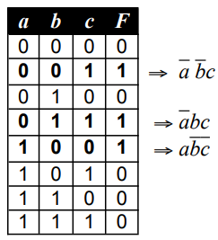
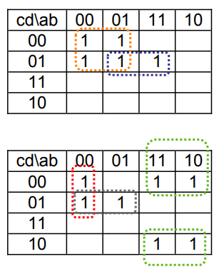

# Álgebra de Boole

**Fecha:** 08-09-2026

## Axiomas

Como toda álgebra, la de Boole parte de un grupo de axiomas, el cual puede adquirir diferentes formas, variando la cantidad y la calidad de axiomas. A continuación indicaremos el tomado en el curso:

1. Existe un conjunto $G$ de objetos, sujetos a una relación de equivalencia denotada por el símbolo $=$ que satisface el principio de sustitución.
    Esto significa que si $a=b$, entonces $b$ puede sustituir a $a$ en cualquier expresión que la contenga, sin alterar la validez de la expresión.
2. **(a)** Se define una regla de combinación $+$ de tal forma que $a+b\in G$ siempre y cuando $a\in G$ y $b\in G$
    **(b)** Se define una regla de combinación $\cdot$ de tal forma que $a\cdot b\in G$ siempre y cuando $a\in G$ y $b\in G$
3. **Neutros**
    **(a)** Existe un elemento $0\in G$ tal que para cada $a\in G$, se cumpla que $a+0=a$
    **(b)** Existe un elemento $1\in G$ tal que para cada $a\in G$, se cumpla que $a\cdot1=a$
4. **Conmutativos**
    Para todo par de elementos $a,b\in G$ se cumple que:
    **(a)** $a+b=b+a$
    **(b)** $a\cdot b=b\cdot a$
5. **Distributivos**
    Para toda terna de elementos $a,b,c$ pertenecientes a $G$ se cumple:
    **(a)** $a+(b\cdot c)=(a+b)\cdot(a+c)$
    **(b)** $a\cdot(b+c)=a\cdot b+a\cdot c$
6. **Complemento**
    Para cada elemento $a\in G$ existe un elemento $\overline{a}$ tal que:
    **(a)** $a\cdot\overline{a}=0$
    **(b)** $a+\overline{a}=1$
7. Existen por lo menos dos elementos $x,y\in G$ tal que $x\neq y$

Existen muchas similitudes entre esta álgebra y la común. Sin embargo, la primera de las reglas distributivas (sobre la suma) y la existencia del complemento las diferencian en forma fundamental.

## Modelo aritmético

El ejemplo más simple del álgebra de Boole se compone del siguiente conjunto $G=\{0,1\}$. Como es natural pensar, estos dos elementos tienen que coincidir con los neutros de las reglas de combinación.

**Por el axioma #3**

1. $0+0=0$
2. $1+0=1$
3. $0\cdot1=0$
4. $1\cdot1=1$

**Por el axioma #4**

5. $0+1=1$
6. $1\cdot0=0$

**Por el axioma #5**

7. Considerando $a,b=1$ y $c=0$:
    $$
    \begin{aligned}
    &1+(1\cdot0)=(1+1)\cdot(1+0)\\
    &\iff\scriptstyle{(\text{reemplazando por los resultados conocidos})}\\
    &1+0=(1+1)\cdot1\\
    &\iff\scriptstyle{(\text{por el axioma \#3})}\\
    &1=1+1
    \end{aligned}
    $$
8. Considerando $a,b=0$ y $c=1$:
    $$
    \begin{aligned}
    &0\cdot(0+1)=(0\cdot0)+(0\cdot1)\\
    &\iff\scriptstyle{(\text{reemplazando por los resultados conocidos})}\\
    &0\cdot1=(0\cdot0)+0\\
    &\iff\scriptstyle{(\text{por el axioma \#3})}\\
    &0=0\cdot0
    \end{aligned}
    $$

Esto nos deja con las reglas completas del álgebra de Boole:

$$
\begin{aligned}
0+0=0\qquad0\cdot0=0\\
0+1=1\qquad0\cdot1=0\\
1+0=1\qquad1\cdot0=0\\
1+1=1\qquad1\cdot1=1\\
\end{aligned}
$$

## Propiedades

### Dualidad

Cada propiedad que demostremos en esta álgebra tiene una versión "dual" que también es cierta. Si analizamos las reglas completas que vimos anteriormente, notaremos que las mismas se presentan de a pares; sustituyendo $0$ por $1$ y $+$ por $\cdot$ podemos obtener la versión "dual" de la propiedad deseada.

### Asociativa

**(a)** $a+(b+c)=(a+b)+c$
**(b)** $a\cdot (b\cdot c)=(a\cdot b)\cdot c$

Si bien las leyes asociativas son muchas veces incluidas dentro del cuerpo axiomático, no lo haremos en este caso; las presentamos como propiedades pues no haremos su demostración en el curso.

### Idempotencia

Para todo elemento en $a\in G$ se cumple que:

- $a+a=a$
- $a\cdot a=a$

**Demostración**

$$
\begin{aligned}
&a+a=a+a\\
&\iff\scriptstyle{(\text{Axioma \#3})}\\
&a+a=(a+a)\cdot1\\
&\iff\scriptstyle{(\text{Axioma \#6b})}\\
&a+a=(a+a)\cdot(a+\overline{a})\\
&\iff\scriptstyle{(\text{Axioma \#5a})}\\
&a+a=a+(a\cdot\overline{a})\\
&\iff\scriptstyle{(\text{Axioma \#6a})}\\
&a+a=a+0\\
&\iff\scriptstyle{(\text{Axioma \#3})}\\
&a+a=a\\
&\land\ \scriptstyle{(\text{por dualidad})}\\
&a\cdot a=a
\end{aligned}
$$

### Neutros cruzados

Para todo elemento $a\in G$ se cumple que:

- $a+1=1$
- $a\cdot0=0$

**Demostración**

$$
\begin{aligned}
&a+1=a+1\\
&\iff\scriptstyle{(\text{Axioma \#6b})}\\
&a+1=a+(a+\overline{a})\\
&\iff\scriptstyle{(\text{por asociatividad})}\\
&a+1=(a+a)+\overline{a}\\
&\iff\scriptstyle{(\text{por idempotencia})}\\
&a+1=a+\overline{a}\\
&\iff\scriptstyle{(\text{Axioma \#6b})}\\
&a+1=1\\
&\land\ \scriptstyle{(\text{por dualidad})}\\
&a\cdot0=0
\end{aligned}
$$

### Complemento de complemento

Para cada elemento de $a\in G$ se cumple que:

- $a=\overline{\overline{a}}$

Además, para todo par de elementos $a,b\in G$ se cumple que:

1. $a+ab=a$
2. $a(a+b)=a$

**Demostración:**

$$
\begin{aligned}
&a+ab=a+ab\\
&\iff\scriptstyle{(\text{Axioma \#3})}\\
&a+ab=a\cdot1+ab\\
&\iff\scriptstyle{(\text{Axioma \#5b})}\\
&a+ab=a(1+b)\\
&\iff\scriptstyle{(\text{por neutros cruzados})}\\
&a+ab=a\cdot1\\
&\iff\scriptstyle{(\text{Axioma \#3})}\\
&a+ab=a\\
&\land\ \scriptstyle{(\text{por dualidad})}\\
&a(a+b)=a
\end{aligned}
$$

Por otra parte, para todo par de elementos $a,b\in G$ se cumple que:

1. $a+\overline{a}b=a+b$
2. $a(\overline{a}+b)=ab$

**Demostración:**

$$
\begin{aligned}
&a+\overline{a}b\\
&=\scriptstyle{(\text{Axioma \#5b})}\\
&(a+\overline{a})\cdot(a+b)\\
&=\scriptstyle{(\text{Axioma \#6})}\\
&1\cdot(a+b)\\
&=\scriptstyle{(\text{Axioma \#3})}\\
&a+b
\end{aligned}
$$

Por dualidad obtenemos el segundo resultado.

### Ley de De Morgan

Para todo par de elementos $a,b\in G$ se cumple que:

1. $\overline{(a+b)}=\overline{a}\cdot\overline{b}$
2. $\overline{ab}=\overline{a}+\overline{b}$

Notar que estas reglas se pueden extender para cualquier cantidad de elementos de $G$.

## Expresiones booleanas

Llamamos constante a todo elemento del conjunto $G$ que define al álgebra. Las variables podrán tomar como valor cualquier elemento de $G$ (es decir $0,1$ en nuestro caso).
Una expresión se puede definir recursivamente como:

1. Las constantes y las variables
2. El complemento de una expresión booleana
3. El OR $(+)$ o AND $(\cdot)$ de dos expresiones booleanas.

## Funciones booleanas

Una función $F$ de $n$ variables $x_1,\ldots,x_n$ booleanas, es una aplicación del espacio $G^n$ sobre el espacio $G$ de tal forma que para cada valor posible de la $n$-upla $x_1,\ldots,x_n$, se asocia un valor del recorrido $G$.

Una de las formas de expresar $F$ es a través de las denominadas tablas de verdad que indican el resultado de $F$ para cada valor posible de la $n$-upla, por ejemplo:

$$
\begin{array}{c|c|c||c}
a&b&c&F\\
\hline
0&0&0&0\\
0&0&1&1\\
0&1&0&0\\
0&1&1&0\\
1&0&0&1\\
1&0&1&1\\
1&1&0&0\\
1&1&1&1\\
\end{array}
$$

Otras formas de representar $F$ incluyen indicar sólo los puntos en los cuales $F$ vale $1$ o sólo los puntos en los cuales vale $0$. Por ejemplo, la función $F$ anterior puede representarse como:

- $F(a,b,c)=\Sigma(1,4,5,7)$ o
- $F(a,b,c)=\Pi(0,2,3,6)$

Donde $\Sigma$ (o $\sigma$ en su defecto) indican aquellos puntos donde $F$ vale $1$, mientras que $\Pi$ indica lo contrario.

La última forma de expresar las funciones es a través de expresiones; por ejemplo la función anterior sería:

- $F(a,b,c)=ac+a\overline{b}+\overline{ab}c$

### Conectivas binarias

Un caso interesante de estudiar es el de las funciones booleanas de dos variables. Como tenemos dos variables, $F$ tiene cuatro duplas posibles (o puntos). Veamos alguna de estas funciones de dos variables que serán de interés.

$$
\begin{array}{cc||c|c|c|c|c|c|c|c}
a&b&\text{OR}&\text{AND}&\text{XOR}&\text{NOR}&\text{NAND}&\text{Equiv.}&\text{Idemp.}&\text{Tautol.}\\
\hline
0&0&0&0&0&1&1&1&0&1\\
0&1&1&0&1&0&1&0&0&1\\
1&0&1&0&1&0&1&0&0&1\\
1&1&1&1&0&0&0&1&0&1\\
\end{array}
$$

Algunas observaciones:
- La NOR es el complemento de la OR
- La NAND es el complemento de la AND
- La XOR (ó exclusivo) puede definirse como: $a\oplus b=\overline{a}b+a\overline{b}$

### OR exclusivo (XOR)

El XOR es una función muy importante (es la suma aritmética binaria módulo $2$) y cumple las siguientes propiedades:

1. Asociativa
2. Conmutativa
3. Distributiva: $a(b\oplus c)=ab\oplus ac$
4. $a\oplus0=a$
5. $a\oplus1=\overline{a}$
6. $a\oplus a=0$
7. Cancelativa: $a\oplus b=a\oplus c\implies b=c$

### Suma de productos canónicos

En esta sección, desarrollaremos un método sistemático para encontrar una expresión algebraica para una función cualquiera dada.
Definimos producto canónico de $n$ variables $x_1,\ldots,x_n$ al producto de todas ellas en el que cada variable aparece exactamente una vez, en forma simple o complementada.

Existe un teorema en el que nos basaremos (sin demostrarlo) que afirma que toda función $f$ de $n$ variables puede expresarse como:

$$
\begin{aligned}
f(x_1,x_2,\ldots,x_n)=\ &x_1\cdot x_2\cdot x_3\cdot\ \ldots\ \cdot x_n \cdot f(1,1,1\ldots,1)\ +\\
&\overline{x_1}\cdot x_2\cdot x_3\cdot\ \ldots\ \cdot x_n \cdot f(0,1,1\ldots,1)\ +\\
&x_1\cdot \overline{x_2}\cdot x_3\cdot\ \ldots\ \cdot x_n \cdot f(1,0,1\ldots,1)\ +\\
&\ \vdots\\
&\overline{x_1}\cdot \overline{x_2}\cdot \overline{x_3}\cdot\ \ldots\ \cdot \overline{x_n} \cdot f(0,0,0\ldots,0)\ +\\
\end{aligned}
$$

Este teorema es fundamental para enunciar el método de construcción de una expresión para representar una función dada. A continuación lo describimos por pasos:

1. Consideramos solamente los puntos en los cuales la función vale $1$, pues aquellos productos canónicos que están multiplicados por un valor de función nulo, se convierten efectivamente en un "sumando" nulo.
2. En dichos puntos, se busca el producto canónico asociado, que es aquel donde la variable aparece simple si en la coordenada vale $1$, o complementada si la coordenada vale $0$.

Por ejemplo, sea $f$ la siguiente función:

Entonces $f$ puede expresarse como:

- $f(a,b,c)=\overline{a}\overline{b}c+\overline{a}bc+a\overline{b}\overline{c}$

## Simplificación de expresiones para funciones booleanas

Hasta ahora, construimos un método sistemático para describir a las funciones booleanas como una expresión de sus variables. Pero este método no asegura que la expresión sea la más simple posible.
Es importante entender, que el hecho de que la expresión sea o no la más simple posible no es algo trivial o caprichoso, es **fundamental** para la construcción práctica de circuitos lógicos, por lo que analizaremos algunos métodos para simplificar expresiones booleanas, para poder aplicarlos a las expresiones obtenidas como sumas de productos canónicos.

### Método algebraico

Este método consiste en la aplicación de transformaciones algebraicas para lograr expresiones más sencillas. Está claro que este método no es sistemático, pero es la base de ellos.
Resumimos acá algunas de las propiedades del álgebra que utilizaremos para simplificar:

1. $f\cdot\overline{f}=0$
2. $f+\overline{f}=1$
3. $g\cdot f+\overline{g}\cdot f=f$
4. $g\cdot f+f=f$
5. $f+\overline{f}\cdot g=f+g$

Veamos un ejemplo para ver como se utilizan estas propiedades para simplificar una expresión.
Sea $f=\overline{ab}c+a\overline{b}c+a\overline{bc}+\overline{a}bc$. Razonemos con las propiedades que mencionamos:

$$
\begin{aligned}
&\overline{ab}c+a\overline{b}c+a\overline{bc}+\overline{a}bc\\
&=\scriptstyle{(\text{propiedad 3 a los dos primeros términos})}\\
&\overline{b}c+a\overline{bc}+\overline{a}bc\\
&=\scriptstyle{(\text{distributividad})}\\
&\overline{b}(c+a\overline{c})+\overline{a}bc\\
&=\scriptstyle{(\text{propiedad 5})}\\
&\overline{b}(c+a)+\overline{a}bc\\
&=\scriptstyle{(\text{distributividad})}\\
&\overline{b}c+\overline{b}a+\overline{a}bc\\
&=\scriptstyle{(\text{distributividad})}\\
&c(\overline{b}+\overline{a}b)+\overline{b}a\\
&=\scriptstyle{(\text{propiedad 5})}\\
&c(\overline{b}+\overline{a})+\overline{b}a\\
&=\scriptstyle{(\text{distributiva})}\\
&\overline{b}c+\overline{a}c+a\overline{b}
\end{aligned}
$$

Sin embargo, esta no es la expresión más reducida de $f$. Veamos que:

$$
\begin{aligned}
&\overline{ab}c+a\overline{b}c+a\overline{bc}+\overline{a}bc\\
&=\scriptstyle{(\text{propiedad 3 al primer término y al cuarto})}\\
&\overline{a}c+a\overline{b}c+a\overline{bc}\\
&=\scriptstyle{(\text{propiedad 3 al segundo término y al tercero})}\\
&\overline{a}c+a\overline{b}
\end{aligned}
$$

Esta si, es la expresión más reducida de $f$.
Como vimos con este ejemplo, el procedimiento descrito no siempre garantiza llegar a la expresión más reducida posible, ya que depende de como se eligen las propiedades a aplicar y los términos sobre los cuales se aplican.

### Diagrama de Karnaugh

El diagrama de Karnaugh es un método de simplificación **sistemático**. Éste se basa en la propiedad 3 que vimos anteriormente:

- $g\cdot f+\overline{g}\cdot f=f$

El método consiste en utilizar una cuadricula en la cual, a cada cuadrado le corresponde un producto canónico posible y que al pasar de uno a otro cualquiera de sus adyacentes, solo cambie el valor de una de las variables en juego. Veamos ejemplos según la cantidad de variables de la expresión que queremos simplificar:

**3 variables**

$$
\begin{array}{c|c|c|c|c}
c/ab&00&01&11&10\\
\hline
0\\
\hline
1\\
\end{array}
$$

**4 variables**

$$
\begin{array}{c|c|c|c|c}
cd/ab&00&01&11&10\\
\hline
00\\
\hline
01\\
\hline
11\\
\hline
10\\
\end{array}
$$

**5 variables**

$$
\begin{array}{c|c|c|c|c}
cd/ab&00&01&11&10\\
\hline
00\\
\hline
01\\
\hline
11\\
\hline
10\\
\end{array}
\qquad
\begin{array}{c|c|c|c|c}
cd/ab&00&01&11&10\\
\hline
00\\
\hline
01\\
\hline
11\\
\hline
10\\
\end{array}
$$

Donde la primera representa aquella donde $e=0$ y la segunda aquella donde $e=1$.

---

En estas cuadrículas, se marca con $1$ los lugares para los cuales la combinación de valores de las variables hace que la función valga $1$.
Luego, el método consiste en intentar agrupar los "unos" formando los rectángulos más grandes posibles, repitiendo este proceso hasta que todos los "unos" estén comprendidos en algún rectángulo (siendo la cantidad total de rectángulos la menor posible).
Es necesario aclarar que la cantidad de elementos agrupados por rectángulo debe ser una potencia de $2$.

**Nota:** El diagrama es circular, los elementos de cada borde son adyacentes con los del borde opuesto. Esto será importante para formar los rectángulos.

Veamos algunos ejemplos:

Una vez que agrupamos en rectángulos con el proceso anterior, la mínima expresión de la función se obtiene sumando el producto de las variables **que no cambian** dentro del rectángulo.
Por ejemplo, en el primer rectángulo naranja cada "uno" tiene que $\overline{a}$ aparece siempre.

Los diagramas anteriores darían las siguientes expresiones simplificadas:

- $f_1=\overline{ac}+b\overline{c}d$
- $f_2=\overline{abc}+\overline{ac}d+a\overline{d}$

#### Nota sobre el diagrama de Karnaugh para 5 variables

Ya vimos que el caso para 5 variables es particular, en el sentido de que usamos 2 tablas diferentes para el valor de la variable $e$.
Lo único diferente que tenemos para estos casos es como funciona la agrupación, por lo que establezcamos dos reglas prácticas para mantener claro este caso:

1. Los bordes son "adyacentes" con sus opuestos como en todos los casos anteriores.
2. Además, las tablas están superpuestas en un sentido tridimensional, una arriba de la otra. Por lo tanto podemos agrupar cuando los "unos" se ubican en diferentes tablas pero misma posición.