# Circuitos combinatorios

**Fecha:** 14-09-2026

## Compuertas

La implementación en circuitos de las conectivas binarias básicas se denominan habitualmente compuertas. Así tendremos compuertas AND, OR, NAND, NOR, XOR y NOT.
Estas se representan por los siguientes símbolos gráficos

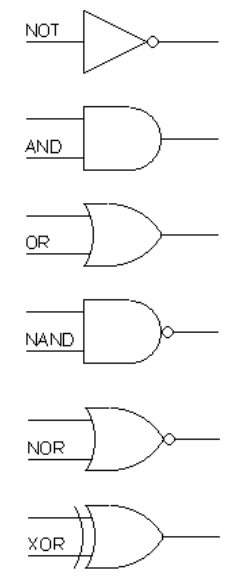

## Circuitos combinatorios

Los circuitos lógicos combinatorios, o simplemente circuitos combinatorios, son circuitos elaborados a partir de compuertas o de otros circuitos del mismo tipo (usados como "bloque constructivo") cuya salida es una función lógica de sus entradas y por tanto las salidas sólo dependen del valor actual de las entradas.
Los circuitos combinatorios son, en definitiva, la implementación en hardware de funciones lógicas (funciones booleanas). Los circuitos se representan como "cajas negras" de las cuales se especifican las entradas, las salidas y la función booleana que los vincula.

### Construcción de circuitos combinatorios

Una forma sistemática siempre aplicable (aunque en algunos casos más trabajosa) para construir un circuito combinatorio parte de la función booleana a implementar representada, por ejemplo, mediante su tabla de verdad. A partir de ella y mapas de Karnaugh (u otro método) se realiza la minimización (en dos niveles) de la misma.
De esta forma se llega a una expresión de la función en base a operaciones NOT, AND y OR (multipuerta).

Una alternativa es identificar partes del circuito que se puedan realizar con otros "bloques constructivos", tales como sumadores de $n$ bits, multiplexores, decodificadores, comparadores o selectores. Luego se reúnen y conectan adecuadamente estos bloques, minimizando, de ser necesario, la lógica de dichas conexiones mediante diagramas de Karnaugh.

Veremos a continuación un par de ejemplos de aplicación de la metodología de construcción.

### Circuito mayoría

Consideremos la función booleana "mayoría", determinada por la siguiente tabla de verdad:

$$
\begin{array}{c|c|c|c}
a&b&c&M\\
\hline
0&0&0&0\\
\hline
0&0&1&0\\
\hline
0&1&0&0\\
\hline
0&1&1&1\\
\hline
1&0&0&0\\
\hline
1&0&1&1\\
\hline
1&1&0&1\\
\hline
1&1&1&1\\
\end{array}
$$

El diagrama de Karnaugh correspondiente resulta:

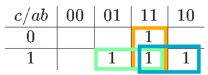

Entonces la función minimizada queda:

- $M=ab+ac+bc$

Y entonces el circuito en base a compuertas AND, OR y NOT tiene la forma:

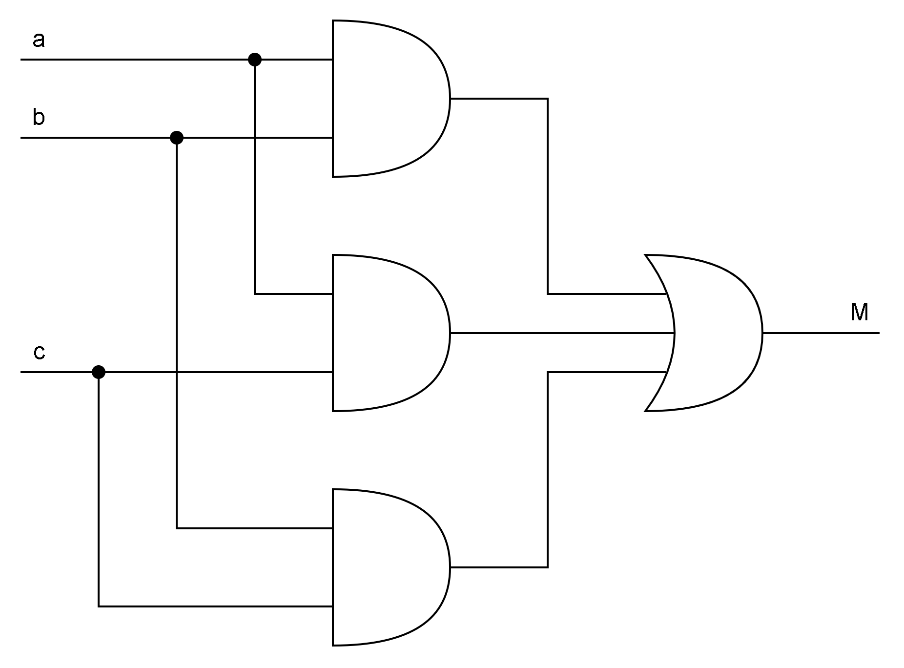

### Circuito semi-sumador

Consideremos ahora la función booleana determinada por la siguiente tabla de verdad, donde $s_1s_0$ representa la suma en binario de las entradas $a_1a_0$ y $b_1b_0$. La salida $c$ es el carry de la operación.

$$
\begin{array}{c|c|c|c|c|c|c}
a_1&a_0&b_1&b_0&s_1&s_0&c\\
\hline
0&0&0&0&0&0&0\\
0&0&0&1&0&1&0\\
0&0&1&0&1&0&0\\
0&0&1&1&1&1&0\\
0&1&0&0&0&1&0\\
0&1&0&1&1&0&0\\
0&1&1&0&1&1&0\\
0&1&1&1&0&0&1\\
1&0&0&0&1&0&0\\
1&0&0&1&1&1&0\\
1&0&1&0&0&0&1\\
1&0&1&1&0&1&1\\
1&1&0&0&1&1&0\\
1&1&0&1&0&0&1\\
1&1&1&0&0&1&1\\
1&1&1&1&1&0&1\\
\end{array}
$$

Los diagramas de Karnaugh correspondientes son:

$s_1$

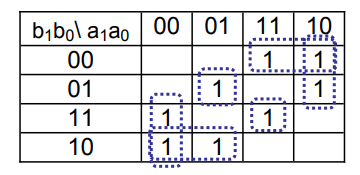

$s_0$

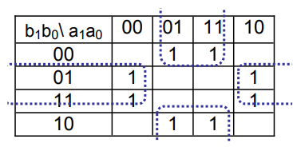

$c$

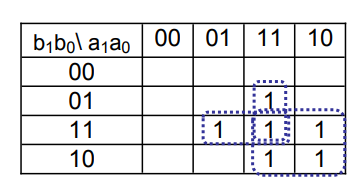

Por lo que las expresiones mínimas de las salidas son:

- $s_1=a_1\overline{b_1b_0}+a_1\overline{a_0b_1}+a_1a_0b_1b_0+\overline{a_1}a_0\overline{b_1}b_0+\overline{a_1a_0}b_1+\overline{a_1}b_1\overline{b_0}$
- $s_0=a_0\overline{b_0}+\overline{a_0}b_0$
- $c=a_1a_0b_0+a_0b_1b_0+a_1b_1$

Los esquemas de los circuitos basados en compuertas para las tres salidas en función de sus expresiones mínimas se presentan a continuación.

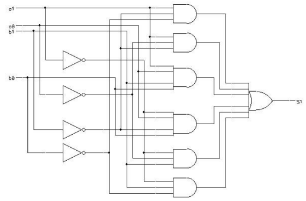
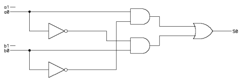
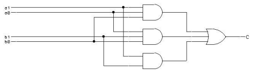

Dado que los tres circuitos corresponden al mismo sistema y tienen las mismas entradas, también puede considerarse un circuido que reutiliza las compuertas NOT y genera las tres salidas como en el siguiente esquema.

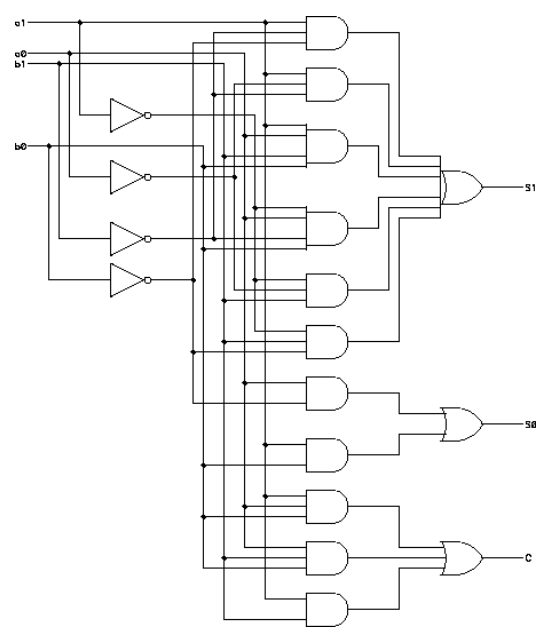

## Bloques constructivos

A continuación veremos algunos ejemplos de circuitos combinatorios útiles para ser utilizados como parte de diseños más complejos. De hecho estos circuitos, o algunas variantes de ellos están disponibles como circuitos integrados independientes, pensando en dicho propósito.

### Circuito decodificador

El circuito decodificador es un circuito con $N$ entradas y $2^N$ salidas. Para el caso $N=3$ por ejemplo, tiene el siguiente símbolo:

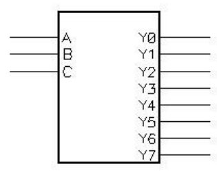

Su tabla de verdad es:

$$
\begin{array}{c|c|c||c|c|c|c|c|c|c|c}
A&B&C&Y7&Y6&Y5&Y4&Y3&Y2&Y1&Y0\\
\hline
0&0&0&0&0&0&0&0&0&0&1\\
0&0&1&0&0&0&0&0&0&1&0\\
0&1&0&0&0&0&0&0&1&0&0\\
0&1&1&0&0&0&0&1&0&0&0\\
1&0&0&0&0&0&1&0&0&0&0\\
1&0&1&0&0&1&0&0&0&0&0\\
1&1&0&0&1&0&0&0&0&0&0\\
1&1&1&1&0&0&0&0&0&0&0\\
\end{array}
$$

Es decir que: dada una combinación de ceros y uno a la entrada, devuelve 1 solamente en la salida cuya posición corresponde al número binario pasado en la entrada.
A continuación veamos una imágen del circuito interno de un decodificador:

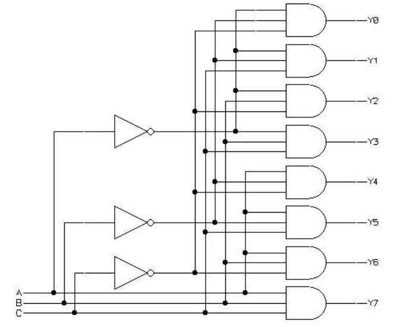

### Circuito multiplexor

El circuito multiplexor tiene $N+2^N$ entradas y 1 salida. Para el caso de $N=3$ tiene el siguiente símbolo:

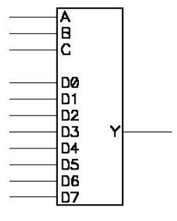

Su tabla de verdad es:

$$
\begin{array}{c|c|c|c}
A&B&C&Y\\
\hline
0&0&0&D0\\
0&0&1&D1\\
0&1&0&D2\\
0&1&1&D3\\
1&0&0&D4\\
1&0&1&D5\\
1&1&0&D6\\
1&1&1&D7\\
\end{array}
$$

Es decir que la salida $Y$ toma el valor de la entrada $D$ cuyo índice coincida con el número binario representado por las entradas $A,B,C$. Las entradas $A,B,C$ se llaman entradas de "control", mientras que las entradas $D$ se llaman de datos.

Una característica distintiva del circuito multiplexor, es su aplicabilidad para la realización de funciones lógicas. Consideremos el siguiente circuito basado en un multiplexor $8$ a $1$:

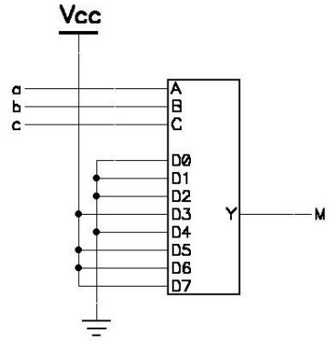

Si escribimos la tabla de verdad de este circuito nos queda:

$$
\begin{array}{c|c|c|c}
A&B&C&M\\
\hline
0&0&0&0\\
0&0&1&0\\
0&1&0&0\\
0&1&1&1\\
1&0&0&0\\
1&0&1&1\\
1&1&0&1\\
1&1&1&1\\
\end{array}
$$

Que coincide con la tabla de verdad del circuito $\text{Mayoria}(a,b,c)$.

Con este ejemplo, podemos observar que asignando un valor apropiado en cada una de las entradas de datos $D$, podemos construir cualquier lógica de $n$ variables con un multiplexor de $n$ entradas de control.

### Circuito demultiplexor

El circuito demultiplexor realiza la tarea inversa al multiplexor. Posee $N$ entradas de control, 1 entrada de datos y $2^N$ salidas, según el símbolo:

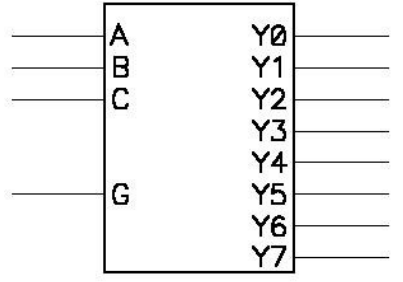

Su tabla de verdad es básicamente la misma del decodificador, con la única diferencia de que el valor de la salida seleccionada depende de la entrada $G$

$$
\begin{array}{c|c|c||c|c|c|c|c|c|c|c}
A&B&C&Y7&Y6&Y5&Y4&Y3&Y2&Y1&Y0\\
\hline
0&0&0&0&0&0&0&0&0&0&G\\
0&0&1&0&0&0&0&0&0&G&0\\
0&1&0&0&0&0&0&0&G&0&0\\
0&1&1&0&0&0&0&G&0&0&0\\
1&0&0&0&0&0&G&0&0&0&0\\
1&0&1&0&0&G&0&0&0&0&0\\
1&1&0&0&G&0&0&0&0&0&0\\
1&1&1&G&0&0&0&0&0&0&0\\
\end{array}
$$

El circuito interno de un demultiplexor es el siguiente:

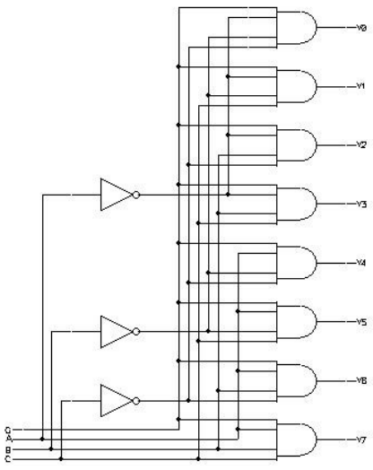