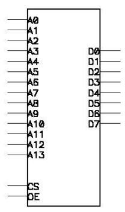
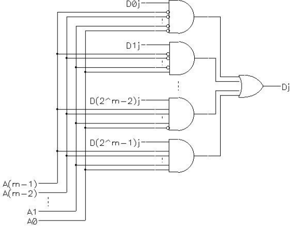
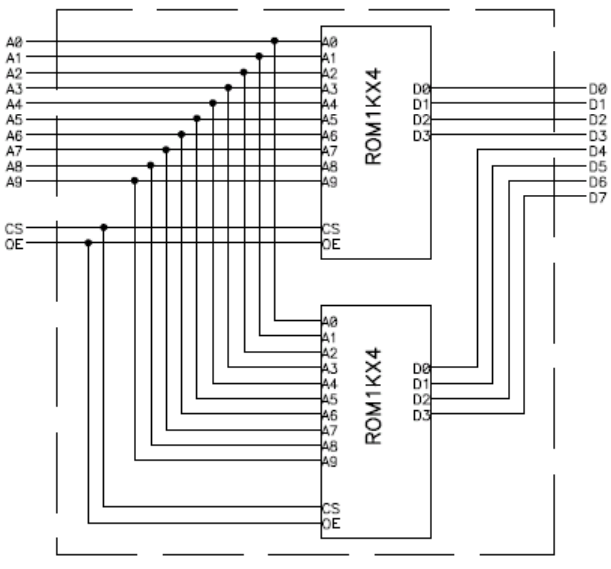
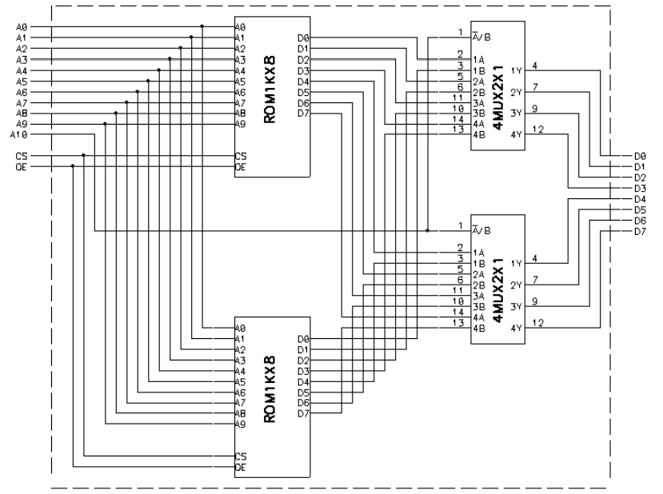
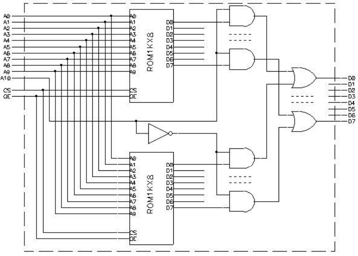
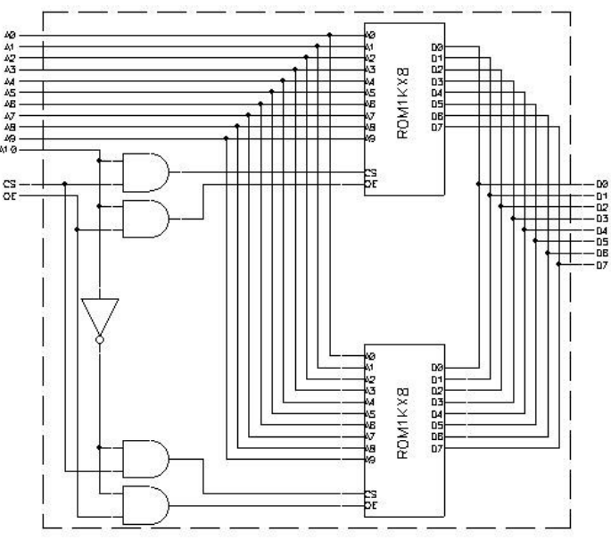
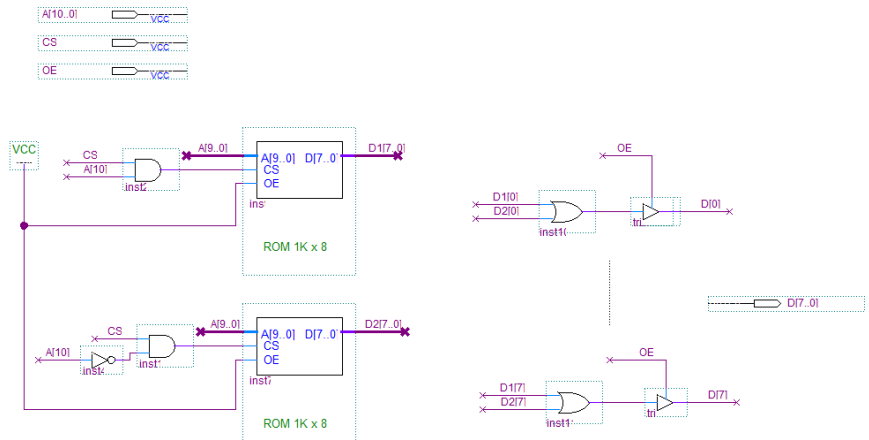

# Memorias ROM

**Fecha:** 18-09-2026

## Introducción

En esta clase, analizaremos un circuito combinatorio especial, que por su variedad de aplicaciones merece un tratamiento diferenciado del resto.
Este circuito tiene $m$ entradas y $n$ salidas. Para el caso de $m=14$ y $n=8$, el símbolo que lo representa es:

En este ejemplo, las entradas se identifican por $A_i$ (por Address) y las salidas por $D_j$ (por Data). Para un caso genérico las entradas serían desde $A_0$ hasta $A_{m-1}$; mientras que las salidas serían desde $D_0$ hasta $D_{n-1}$.

La tabla de verdad de un circuito ROM, está formado por $2^m$ filas, y $m+n$ columnas.
En la tabla, la parte de las entradas es conocida; pero la parte de las salidas puede representar cualquier combinación posible de ceros y unos. De hecho, podemos representar una salida cualquiera como $D_{ij}$, donde:
- $0<i<2^m-1$
- $0<j<n-1$

Esta tabla de verdad puede verse como la descripción del contenido de un "array" de $2^m$ elementos que tienen $n$ bits cada uno. Como es un circuito combinatorio, los valores concretos de los bits de los elementos (los $D_{ij}$) son fijos, predeterminados.
Por estas dos características, a estos circuitos se los denomina como Read Only Memory, o más brevemente **ROM**.

Es fácil observar que con una ROM se puede implementar cualquier función lógica de $m$ variables de entrada y $n$ salidas. Basta con especificar el contenido de la ROM de manera que los $n$ bits de cada palabra (posición del array) correspondan al valor de la función en el punto (que coincide con el índice del array).

## Circuito interno

El circuito interno de una ROM para cada uno de los $n$ bits de salida, tiene la siguiente forma:

Para programar la tabla de verdad en una ROM, el fabricante establece físicamente el estado de cada entrada de la compuerta AND asociada a $D_{ij}$: conecta la línea a tierra (0V) para representar un nivel lógico $0$, o a Vcc (voltaje de alimentación) para representar un nivel lógico $1$.

## Capacidad y organización

Las memorias ROM están caracterizadas por una cierta capacidad, que se mide en bits (o Kilobits, Megabits o Gigabits) y una determinada organización que se expresa en cantidad de palabras de tantos bits.
Por ejemplo:

- ROM de 8Kbits, con organización de 1Kx8 (1 Kilo palabras de 8 bits)
- ROM de 8Kbits, con organización de 4Kx2 (4 Kilo palabras de 2 bits)
- ROM de 8Kbits, con organización de 1Kx8 (1 Kilo palabras de 8 bits)

## Arreglos de memoria

Las memorias se utilizan en combinaciones (arreglos) normalmente denominados "bancos de memoria". Estos permiten la construcción de memorias del tamaño requerido por el sistema en base a otros circuitos integrados disponibles (es habitual que se requiera más memoria de la que puede suministrar un único circuito integrado, o que el tamaño de palabra necesario sea otro).

En los próximos diagramas de circuitos aparecerán las entradas CS y OE. El significado y la utilización de éstas se verá más adelante en esta misma clase. Por ahora consideremos que son entradas que existen en todas las ROMs, y por lo tanto deben existir en las ROMs compuestas que vamos a diseñar.

### Aumentar el tamaño de palabra

Uno de estos casos es lograr una memoria ROM de $n$ bits de salida a partir de memorias de menor cantidad de bits (su tamaño de palabra es menor que el requerido).

Veamos como se construye un banco así utilizando un ejemplo: supongamos que queremos construir una ROM de 1Kx8 y disponemos solamente de ROMs de 1Kx4.

Lo primero es determinar la cantidad de memorias requeridas. En este caso vemos que la memoria solicitada tiene una capacidad de 8Kbits y las disponibles de 4Kbits. De esto entendemos que se necesitarían dos. Por otro lado el análisis de la organización solicitada y la disponible, confirma esta cantidad.

No es díficil concluir que el circuito de la ROM 1Kx8 equivalente es el representado por el diagrama esquemático a continuación:

### Aumentar la cantidad de palabras

En este caso el objetivo es lograr una memoria ROM de $m$ bits de entrada a partir de memorias de menor cantidad de bits de dirección.
Veamos como se construye un banco así utilizando un ejemplo: supongamos que queremos construir una ROM de 2Kx8 y disponemos solamente de ROMs de 1Kx8.

Al igual que en el caso anterior lo primero es determinar la cantidad de memorias requeridas. En este caso vemos que la memoria solicitada tiene una capacidad de 16 Kbits y las disponibles de 8 Kbits. Con esto concluimos que también necesitamos utilizar dos al igual que el caso anterior. Por otro lado el análisis de la organización solicitada y la disponible, confirma esta cantidad.

En el caso anterior, cada ROM contribuía con una parte de los bits de salida. En este caso cada ROM contribuirá con una parte del rango de direcciones. La ROM a construir tiene 11 bits de entrada, con un rango de direcciones de 0 a 2047. Cada ROM disponible tiene 10 bits de entrada, con un rango de direcciones de 0 a 1023. Por tanto cada ROM contribuirá con la mitad de las posiciones: una de ellas aportará las posiciones de 0 a 1023 y la otra aportará las posiciones de 1024 a 2047. Para seleccionar que ROM se conecta a la salida utilizamos multiplexores de 2x1, controlados por el bit más significativo de las entradas de dirección. El circuito que implementa el funcionamiento es:

Un circuito **4MUX2x1 (o cuádruple multiplexor de 2 a 1)** contiene cuatro multiplexores independientes de dos entradas, **los cuales comparten una línea de selección común**

**Nota:** Esta ROM no provee funcionalidad de OE en la salida, y por lo tanto es incompleta (ver sección de lógica de tercer estado).

A continuación veremos un diagrama en donde los multiplexores se han explicitado en sus equivalentes AND y OR (omitiendo la repetición de la estructura de compuertas para no sobrecargar el dibujo):

## Chip select

La entrada CS (Chip Select) permite ahorrar en la implementación de la estructura de ANDs que estamos colocando a la salida de las ROMs para elegir cual de ellas conecta a la salida en función del bit más significativo de la dirección.
En otras palabras, las compuertas AND están incluidas dentro del chip de la ROM y el selector es la entrada CS.

Si CS es 0, todas las salidas de la ROM están en 0, con independencia de las entradas de dirección y del valor almacenado en la posición de la ROM indicada por dicha dirección; por otra parte, si CS es 1, las salidas presentan el contenido de la ROM en la posición señalada por la dirección.

### Aplicación del chip select para arreglos de memoria

El circuito de la ROM de 2Kx8 queda simplificado por el uso del CS de esta manera:

## Lógica de tercer estado (tri-state)

En el ejemplo anterior se ve que las OR que se colocan a la salida en realidad siempre tienen una de sus entradas en 0. Esto es por el funcionamiento del circuito en donde se utilizan como salida lógica de un selector.

Dada esa propiedad, uno podría verse tentado de quitar los OR y unir las salidas.
Desde el punto de vista lógico, esto no es posible porque sería equivalente a igualar dos variables de valor distinto. Desde el punto de vista eléctrico, esto provocaría un cortocircuito, que dañaría las salidas que se unen de esta forma.

Para poder implementar OR "cableados" se diseñaron los circuitos de manera que tuvieran salidas de tres estados posibles: 0, 1 y Z. El estado Z también se denomina "tercer estado", "estado de alta impedancia", "estado indiferente", "tri-state".

Los circuitos que tienen este tipo de salida disponen también de una entrada denominada OE (output enable) o similar. Cuando dicha entrada de control está en 0, la salida pasa al "estado de alta impedancia" y cuando la entrada de control está en 1, la salida está en estado lógico 0 o 1.

### Aplicación de lógica tri-state con Output Enable

Se presenta a continuación como queda el circuito de la ROM 2Kx8 simplificado por el uso de la lógica de tres estados a través de la entrada de control OE:

### Como remediar la falta de entrada OE en circuitos vistos hasta ahora

Como vimos en alguno de los circuitos anteriores, se presentaba un problema importante ahora que conocemos el uso de la entrada OE: no contaban con ésta.

Para remediar este problema, se debe agregar un conjunto de buffers triestado luego de la lógica combinatoria que genera la salida. A continuación se presenta la misma ROM de la figura anterior, pero con funcionalidad OE incorporada:

**Nota:** En la figura se utilizan dos nuevas notaciones para los diagramas.
Por un lado, la notación de "bus", donde un conjunto de N+1 bits se definen como $[\text{N}\ldots0]$ y se pueden referenciar individualmente según su índice.
Por otro lado, se utiliza una notación "inalámbrica", donde en lugar de unir los cables directamente, se referencian los nombres para indicar las conexiones. Esta notación es muy útil para evitar la superposición de cables.