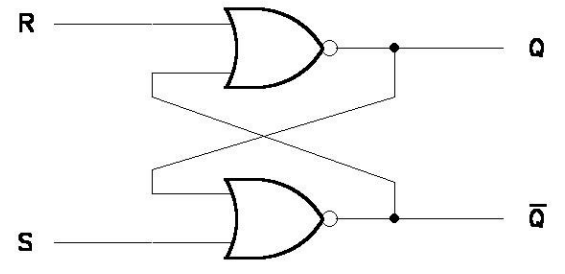

# Flip-flops

**Fecha:** 25-09-2026

## Introducción

En esta clase empezaremos a analizar los circuitos secuenciales, circuitos que a diferencia de los combinatorios, determinan el valor de sus salidas no solo en función del valor actual de sus entradas, sino que también en función de los valores anteriores de las mismas.

Comenzaremos por estudiar un caso particular de circuitos secuenciales: los flip-flops, para luego introducirnos al diseño de circuitos secuenciales con el caso particular de los circuitos contadores, para finalmente incursionar en el tema de máquinas de estado como herramienta de especificación y síntesis de circuitos secuenciales generales.

Como ya se adelantó, el flip-flop es un caso particular de circuito secuencial y se lo puede ver como un "elemento de memoria", un circuito que tiene la capacidad de "recordar" un valor de la entrada previo al actual.
Existen distintos tipos de flip-flops como veremos a continuación.

### Flip-flop R-S asíncrono

El FF R-S asíncrono (también denominado Latch) es un circuito que tiene la forma:

Tenemos solo dos entradas: R y S. 
Por otra parte, las salidas del circuito son Q, que es la salida principal y Q', que es simplemente la negación de Q.

A continuación estudiaremos el comportamiento del circuito para cada combinación posible de R y S:

- **R=1, S=0:** Entonces las salidas Q=0 y Q'=1. Esto es verificable fácilmente, ya que si R=1 el NOR de arriba será 0; por lo que la salida del NOR de abajo será 1, ya que ambas sus entradas serán 0.
- **R=0, S=1:** Por un razonamiento análogo al anterior, en este caso las salidas serán inversas: Q=1, Q'=0
- **R=0, S=0:** Para este caso a priori no tenemos como saber que valores tendrá la salida. Lo único que sabemos es que hay dos opciones posibles, o Q=1 y Q'=0 o Q=0 y Q'=1 (esto se determina por la forma del circuito).
    Para saber cual de las combinaciones de salidas se producen, debemos analizar cuales eran los valores anteriores de R y S.
    Si se llega a R=S=0 desde R=1 y S=0, resulta que las salidas serán Q=0 y Q'=1; mientras que si se llega desde R=0 y S=1, las salidas serán Q=1 y Q'=0.
    Esta propiedad nos permite afirmar que al pasar sus entradas por 0, el circuito "recuerda" cual fue la última entrada en 1. Este es el concepto de "memoria" mencionado en la introducción.
- **R=1, S=1:** Este caso es particular: las salidas serán Q=Q'=0 por los NOR. Hay una explicación más profunda, pero nos basta con el problema de que $Q=Q'$ y esto es "absurdo"; este comportamiento se considera indefinido.

Resumiendo, la tabla de verdad de este circuito es:

$$
\begin{array}{c|c|c}
R&S&Q_{n+1}\\
\hline
0&0&Q_n\\
0&1&1\\
1&0&0\\
1&1&-\\
\end{array}
$$

El nombre de las entradas viene de SET (salida principal en 1) y RESET (salida principal en 0).
