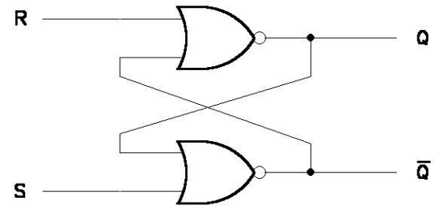
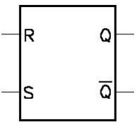
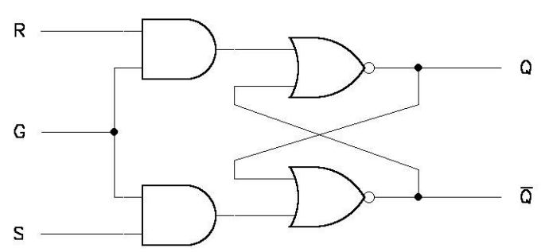
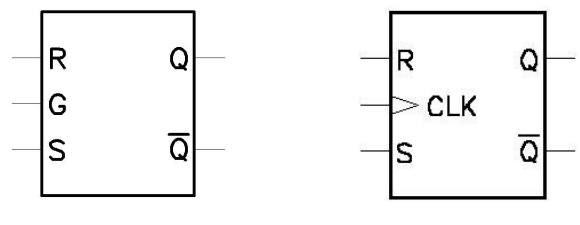
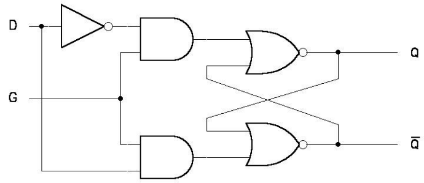
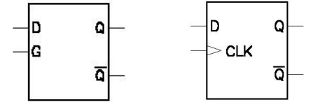
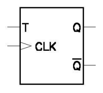
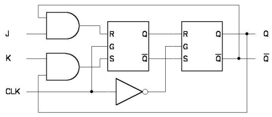

# Flip-flops

**Fecha:** 25-09-2026

## Introducción

En esta clase empezaremos a analizar los circuitos secuenciales, circuitos que a diferencia de los combinatorios, determinan el valor de sus salidas no solo en función del valor actual de sus entradas, sino que también en función de los valores anteriores de las mismas.

Comenzaremos por estudiar un caso particular de circuitos secuenciales: los flip-flops, para luego introducirnos al diseño de circuitos secuenciales con el caso particular de los circuitos contadores, para finalmente incursionar en el tema de máquinas de estado como herramienta de especificación y síntesis de circuitos secuenciales generales.

Como ya se adelantó, el flip-flop es un caso particular de circuito secuencial y se lo puede ver como un "elemento de memoria", un circuito que tiene la capacidad de "recordar" un valor de la entrada previo al actual.
Existen distintos tipos de flip-flops como veremos a continuación.

### Flip-flop R-S asíncrono

El FF R-S asíncrono (también denominado Latch) es un circuito que tiene la forma:

Tenemos solo dos entradas: R y S.
Por otra parte, las salidas del circuito son Q, que es la salida principal y Q', que es simplemente la negación de Q.

A continuación estudiaremos el comportamiento del circuito para cada combinación posible de R y S:

- **R=1, S=0:** Entonces las salidas Q=0 y Q'=1. Esto es verificable fácilmente, ya que si R=1 el NOR de arriba será 0; por lo que la salida del NOR de abajo será 1, ya que ambas sus entradas serán 0.
- **R=0, S=1:** Por un razonamiento análogo al anterior, en este caso las salidas serán inversas: Q=1, Q'=0
- **R=0, S=0:** Para este caso a priori no tenemos como saber que valores tendrá la salida. Lo único que sabemos es que hay dos opciones posibles, o Q=1 y Q'=0 o Q=0 y Q'=1 (esto se determina por la forma del circuito).
  Para saber cual de las combinaciones de salidas se producen, debemos analizar cuales eran los valores anteriores de R y S.
  Si se llega a R=S=0 desde R=1 y S=0, resulta que las salidas serán Q=0 y Q'=1; mientras que si se llega desde R=0 y S=1, las salidas serán Q=1 y Q'=0.
  Esta propiedad nos permite afirmar que al pasar sus entradas por 0, el circuito "recuerda" cual fue la última entrada en 1. Este es el concepto de "memoria" mencionado en la introducción.
- **R=1, S=1:** Este caso es particular: las salidas serán Q=Q'=0 por los NOR. Hay una explicación más profunda, pero nos basta con el problema de que $Q=Q'$ y esto es "absurdo"; este comportamiento se considera indefinido.

Resumiendo, la tabla de verdad de este circuito es:

$$
\begin{array}{c|c|c}
R&S&Q_{n+1}\\
\hline
0&0&Q_n\\
0&1&1\\
1&0&0\\
1&1&-\\
\end{array}
$$

Por otra parte, el símbolo que se utiliza para representar el bloque de circuito es:

El nombre de las entradas viene de SET (salida principal en 1) y RESET (salida principal en 0).

### Flip-flop R-S sincrónico

Uno de los problemas que se presentan al intentar utilizar este tipo de circuitos como elemento de memoria es el hecho de las entradas R y S pueden variar en momentos no deseados y el flip-flop responderá según esos cambios según su tabla de verdad.

Para evitar esta situación, se introduce una señal de sincronismo para el circuito: la habilitación o el reloj. Ésta indicará cuando son válidos los valores de R, S y cualquier otra señal significativa para el circuito completo. Esta entrada puede actuar de distintas maneras como veremos más adelante.

El circuito interno de un flip-flop R-S sincrónico es el siguiente:

Cuando la entrada de control G está en 1, las entradas R y S aparecen en la entrada de los NOR, mientras que si la entrada de control G está en 0, entonces las entradas de los NOR serán ambas 0.
A este tipo de control del circuito, donde las entradas se consideran solo si la entrada de control G está en 1; se denomina "control por compuerta", "control por habilitación" o "control por nivel".

El otro tipo de control corresponde a un circuito donde lo que interesa es la transición de 0 a 1 de la entrada de control. En este caso se dice que se trabaja con un "reloj (clock) por flanco".

Normalmente en el curso trabajaremos con flip-flops R-S que funcionan en la modalidad "por nivel", mientras que en los restantes lo habitual será trabajar en modalidad "por flanco".

Los símbolos de este flip-flop son:

### Flip-flop D

Este flip-flop puede verse como una variante del flip-flop R-S, que tiene el siguiente circuito interno:

Este circuito se comporta como el R-S para cuando R y S toman valores opuestos.
Esto lleva a que la tabla de verdad de un flip-flop D es:

$$
\begin{array}{c|c}
\text{D}&\text{Q}_{n+1}\\
\hline
0&0\\
1&1\\
\end{array}
$$

Y su ecuación característica es:

$$
\boxed{\text{Q}_{n+1}=\text{D}_n}
$$

Lo que indica esta ecuación con palabras, es que el nuevo valor de la salida Q corresponde al valor actual de la entrada D.
Los subíndices en las ecuaciones características se interpretan de la siguiente manera:

- $n$ representa el instante o estado actual.
- $n+1$ representa el instante o estado siguiente, correspondiente al siguiente evento de sincronización del circuito.

Para ser más precisos con el comportamiento de este circuito:

- Para los flip-flops D con control por nivel: cuando la entrada G=1, el nuevo valor de la salida corresponde a la salida D; mientras que si G=0, la salida mantiene el valor de D inmediatamente anterior a la transición de 1 a 0 para la entrada G.
- Para los flip-flops D con control por flanco, el nuevo valor de la salida corresponde al valor de la entrada D al momento de la transición de la entrada CLK de 0 a 1. Mientras la entrada CLK no se encuentra en transición, la salida se mantendrá en el último valor, sin importar si existen cambios en D.

Los símbolos de este flip-flop son:

### Flip-flop T

El flip-flop T (toggle) tiene el siguiente símbolo:

Y la siguiente ecuación característica:

$$
\boxed{\text{Q}_{n+1}=\text{Q}_n\text{T}_n'+\text{Q}_n'\text{T}_n}
$$

Que corresponde a la siguiente tabla de verdad reducida:

$$
\begin{array}{c|c}
\text{T}&\text{Q}_{n+1}\\
\hline
0&\text{Q}_{n}\\
1&\text{Q}_{n}'\\
\end{array}
$$

Todo esto describe un circuito que mantiene su salida incambiada en el tiempo cuando T=0; o bien la invierte en cada flanco ascendente cuando T=1.

### Flip-flop J-K

Este flip-flop busca resolver definitivamente el problema del flip-flop R-S. Consiste en dos flip-flops R-S sincrónicos por nivel conectados en "cascada" y retroalimentados de la siguiente manera:

Analizamos el comportamiento del circuito a continuación para deducir la tabla de verdad y su ecuación característica.

Los flip-flops RS que se utilizan en el circuito, son complementarios: nunca están habilitados simultaneamente. Por ejemplo, mientras el segundo está habilitado, el primero mantiene sus salidas, por lo que las entradas del segundo permanecen estables.

Las entradas del primer flip-flop interno son R=JQ' y S=KQ, con esto en mente podemos analizar cada combinación posible de J y K para determinar la salida.

- **J=0,K=0:** El primer flip-flop tiene ambas sus entradas en cero, por lo que su salida será la misma que la anterior $Q_n$ y entonces el resultado del segundo flip-flop no cambia. Concluimos que la salida permancece igual: $Q_{n+1}=Q_n$

- **J=0,K=1:** El primer flip-flop tiene su entrada R=0, tenemos dos subcasos para la entrada S (o bien es 1 si Q=1 o bien es 0 en el otro caso). En el caso en que la entrada S=0, entonces ya sabemos que Q=0; por otra parte si Q=1, el primer flip-flop hace un set, que corresponde a un reset en el segundo flip-flop: esto corresponde nuevamente a una salida Q=0. Concluimos que: $Q_{n+1}=0$

- **J=1,K=0:** Este caso es análogo al anterior, mantiene el comportamiento del set. Concluimos que $Q_{n+1}=1$

- **J=1,K=1:** Este es el caso especial que no pudimos resolver con el flip-flop R-S. Notemos que R=Q' y S=Q, por lo que R y S nunca valen 1 simultaneamente: por esto no llegamos al caso prohibido. Veamos con detenimiento los subcasos:
  - Si Q=0 entonces R=1, por lo que el primer flip-flop hará un reset, el segundo un set, resultando entonces en un cambio de estado a Q=1.
  - Si Q=1 entonces S=1, por lo que el primer flip-flop hará un set, el segundo un reset, resultando en un cambio de estado a Q=0.

  Entonces en este caso podemos concluir que la salida se invierte, es decir que $Q_{n+1}=Q_n'$.

Todo este razonamiento nos lleva a la siguiente ecuación característica:

- $Q_{n+1}=JQ'+K'Q$

Y la tabla de verdad:

$$
\begin{array}{cc|c}
J&K&Q_{n+1}\\
\hline
0&0&Q_n\\
0&1&0\\
1&0&1\\
1&1&Q_{n+1}\\
\end{array}
$$
